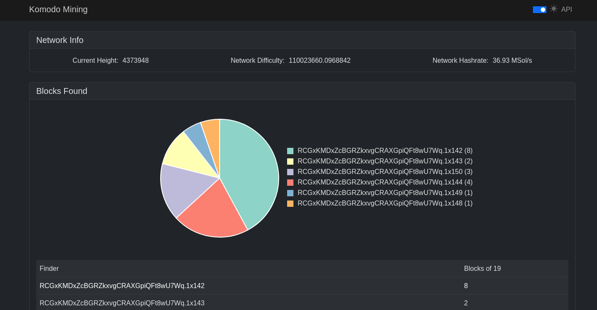

## Solomining for Komodo ecosystem.
## READY FOR TESTING!!!!!!!!!!!!!!

## The solo miner's solo pool
The objective is a "light-weight" pool that does what needs to be done.  
We're no longer calling this a "poxy" as that term was meant to bridge getwork and stratum and no client even has getwork anymore.  
This pool will **not** work for MCL (due to alternating blocks using CCs), to come later.  

## When all else fails: RTFM!

Requirements
------------
* node v21.4+ (installs by following "Install" below)
* coin daemon

Install (Ubuntu)
-------------
Yes, this is "a lot" for beginners to understand; however, solo mining isn't meant to be easy. Copy/paste into terminal:

```shell
NODE_MAJOR=21
sudo apt-get update
sudo apt-get install -y ca-certificates curl gnupg build-essential libsodium-dev

sudo mkdir -p /etc/apt/keyrings
curl -fsSL https://deb.nodesource.com/gpgkey/nodesource-repo.gpg.key | sudo gpg --dearmor -o /etc/apt/keyrings/nodesource.gpg
echo "deb [signed-by=/etc/apt/keyrings/nodesource.gpg] https://deb.nodesource.com/node_$NODE_MAJOR.x nodistro main" | sudo tee /etc/apt/sources.list.d/nodesource.list

sudo apt-get update
sudo apt-get install nodejs -y

sudo npm install npm -g

git clone https://github.com/ComputerGenieCo/komodo-solomining
cd komodo-solomining
npm install
```

Configure
-------------
Go to config.json and change it to your setup.

Recomended diffs (1 diff per 1k Sol/s per device):
-------------
GPU: 1  
Minis: 10  
Small ASICs (z9): 40  
Large ASICs (A9++ - Z15): 140-840  
Rentals: 1000 per 1M Sol/s

Run
------------
```bash
npm start
```

Update (normally)
-------------
```bash
git pull
```

Update (including any module changes )
-------------
```bash
git pull
rm -rf node_modules
npm install
```

Differences between this and Z-NOMP
------------
* This is meant for solo mining.
* There is no share-based pay system.
* No payments (coins go directly to the address in config).
* No equihashverify - While this pool will work with rentals (NiceHash checked at the time of publishing), it is intended
for the true solo miner, who needs no such protection against fake shares.

Notes and known issues:
------------
* (N) VarDiff only waits 1/2 of `retargetTime` when miners first enter the pool in order to establish an initial stats set.

* (N KI) Currently the stratum only covers basic chains: no founders, no special cases (like MCL).

* (N) There is no TLS or miner banning functionality, because I'm not sure I could ever be convinced of need for a solo setup.

License
-------
Released under the GNU General Public License 3
http://www.gnu.org/licenses/gpl-3.0.html

_Forked from [aayanl/equihash-solomining](https://github.com/aayanl/equihash-solomining) which is licensed under GNU GPL v2 and now directs to WaveringAna_
[Original docs](https://rocketchat.zdeveloper.org/wiki:z-nomp_install)
